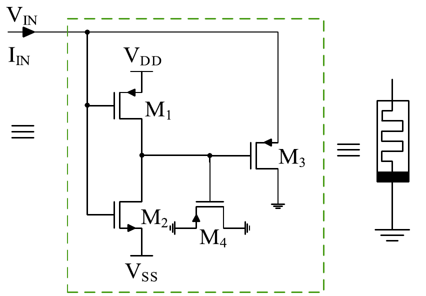
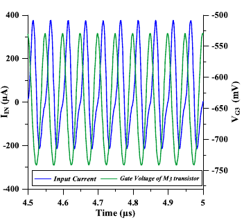
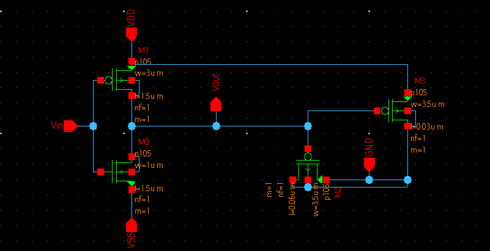
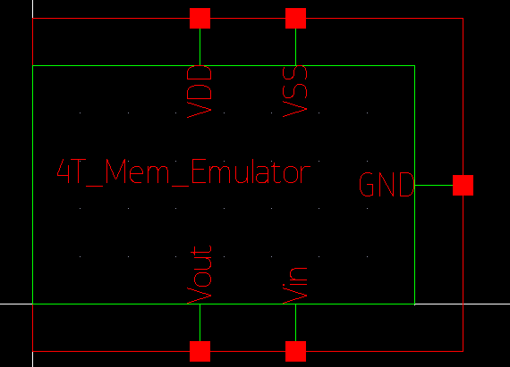
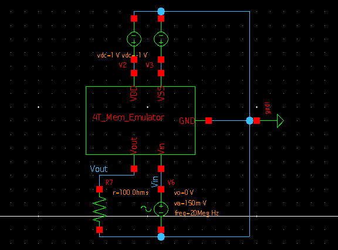
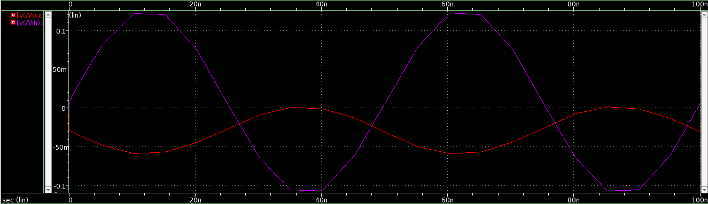

# A Memristor Emulator using 4 MOSFETs

## Table of Contents
1. [Introduction](#introduction)
2. [Reference Circuit](#reference-circuit)
3. [Implementation](#implementation)
4. [Schematic Netlist](#schematic-netlist)
5. [Simulation result](#simulation-result)
6. [References](#references)
7. [Acknowledgements](#acknowledgements)
8. [Author](#author)

## Introduction
A memristor is a 2 terminal device that is claimed to be the
4th fundamental circuit element along with resistor capacitor
and inductor. 

The memristance of a device is described by
the notation M (φ) where,
d(φ) = M d(q)


Real memristor devices devices such as the HP Labs TiO2
device are not that stable and not easily accessible. Thus
most research and application for memristive systems is done
with memsristor emulators that are built with a combination
of discrete components and integrated componets like BJT,
OpAmp and multipliers.


Two of the definite characteristics of a memristors are:
1. Pinched hysteresis
2. Frequency dependent hysteresis curve


As stated by Leon Chua himself, any element that is able to
show these 2 characteristics is a memristor. And thus through
an emulator, a 2 terminal device can be created that is capable
of showing these 2 characteristics.

## Reference Circuit
The reference circuit of the 4 transistor mosfet only memristor and it's expected waveform is as shown:
<p align="center">
	 
	<h5 align="center">Figure 1: Reference circuit of MOS only memristor</h5>
</p>

<p align="center">
	 
	<h5 align="center">Figure 2: Reference output to a sinusoidal input</h5>
</p>


## Implementation
The schematic shown in Fig.1 was implemented in Synposys custom compiler and a symbol was created from it.
<p align="center">
	 
	<h5 align="center">Figure 3: The schematic recreated from the refrence</h5>
</p>
<p align="center">
	 
	<h5 align="center">Figure 4: Symbol made from the schematic</h5>
</p>

A test bench of this was created for giving a sinusoidal input while keeping Vdd = +1V and Vss = -1V
<p align="center">
	 
	<h5 align="center">Figure 5: Testbench created for the memristor</h5>
</p>

## Schematic Netlist
The SPICE netlist obtained from the test bench is:
```spice
* Generated for: PrimeSim
* Design library name: memEmulator
* Design cell name: memWithCMOS_TB
* Design view name: schematic
.lib 'saed32nm.lib' TT

*Custom Compiler Version S-2021.09
*Tue Mar 1 10:50:25 2022

.global gnd!
********************************************************************************
* Library : memEmulator
* Cell : memWithCMOS
* View : schematic
* View Search List : hspice hspiceD schematic spice veriloga
* View Stop List : hspice hspiceD
********************************************************************************
.subckt memwithcmos gnd_1 vdd vss vin vout
xm0 vout vin vss vout n105 w=1u l=1.5u nf=1 m=1
xm3 gnd_1 vout vdd gnd_1 p105 w=3.5u l=0.03u nf=1 m=1
xm2 gnd_1 vout gnd_1 gnd_1 p105 w=3.5u l=0.06u nf=1 m=1
xm1 vout vin vdd vout p105 w=3u l=1.5u nf=1 m=1
.ends memwithcmos

********************************************************************************
* Library : memEmulator
* Cell : memWithCMOS_TB
* View : schematic
* View Search List : hspice hspiceD schematic spice veriloga
* View Stop List : hspice hspiceD
********************************************************************************
xi0 net18 net6 net8 vin vout memwithcmos
v3 net8 net18 dc=-1
v2 net6 net18 dc=1
v6 vin net18 dc=0 sin ( 0 150m 20 0 0 0 )
r7 vout net18 r=100

```

## Simulation Result
<p align="center">
	 
	<h5 align="center">Figure 6: Transient analysis of 20MHz sine wave</h5>
</p>

The obtained result is not a perfect match of the result shown in Fig.2 this may be due to different technology node being used or not having the exact W/L sizes but only getting the ratios.

## References
- Babacan, Yunus, Abdullah Yesil, and Fatih Gul. ”The fabrication and MOSFET-only circuit implementation of semiconductor memristor.” IEEE Transactions on Electron Devices 65.4 (2018): 1625-1632.

## Acknowledgements
- VSD Pvt. Ltd
- IIT Hyderabad
- Synopsys

## Author
Abel Joseph John
